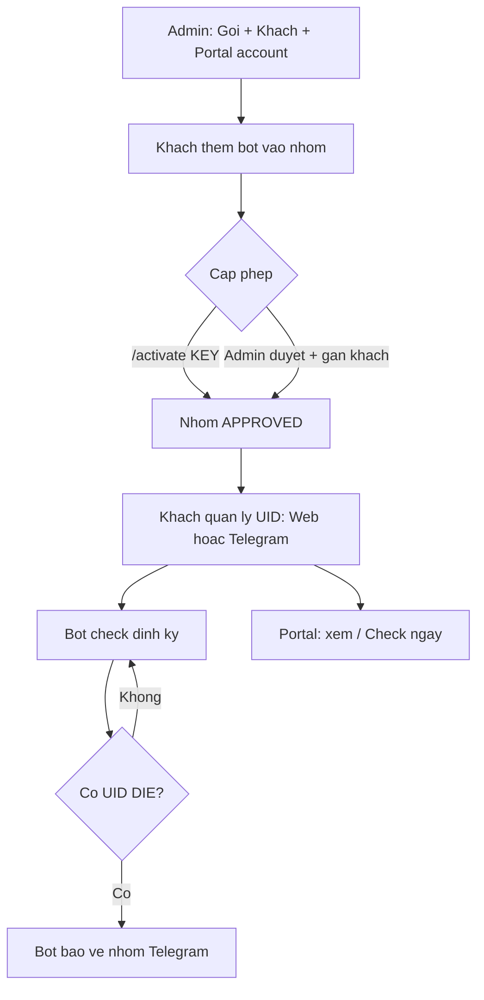

# Hướng dẫn sử dụng - Checklive Bot

> Hướng dẫn vận hành hệ thống bot Telegram check live/die UID Facebook.
> Gồm 3 phần: (A) Admin dùng web quản trị, (B) Khách hàng dùng **Portal web** quản lý UID, (C) Người dùng bot trong nhóm Telegram.

Cập nhật lần cuối: 2026-07-16

---

## 0. Các thành phần & địa chỉ

| Thành phần | Địa chỉ | Vai trò |
|---|---|---|
| Web (frontend) | https://checklive-wayne.online | Trang đăng nhập chung |
| Web Admin | https://checklive-wayne.online/dashboard | Quản trị hệ thống (ADMIN / SUB_ADMIN) |
| Portal khách | https://checklive-wayne.online/my-groups | Khách quản lý UID trên web (USER) |
| Đổi mật khẩu | https://checklive-wayne.online/change-password | Mọi tài khoản đã đăng nhập |
| API Backend | https://api.checklive-wayne.online/api/v1 | Xử lý logic, DB, bot |
| API Docs (Swagger) | https://api.checklive-wayne.online/api/v1/docs | Thử API |
| Telegram Bot | trong nhóm Telegram | Nhận lệnh, check UID |

Tài khoản admin mặc định (đổi trong `.env` / sau khi seed): `admin@checklive.local` / `admin12345`.

**Phân quyền đăng nhập web:**

| Role | Vào được | Sau đăng nhập chuyển tới |
|---|---|---|
| ADMIN / SUB_ADMIN | Web quản trị | `/dashboard` |
| USER (`canUseApp = true`) | Portal khách | `/my-groups` |
| USER (`canUseApp = false`) | Không đăng nhập được | Thông báo: *"Tài khoản đã bị khóa. Vui lòng liên hệ admin."* |

**Liên kết khách ↔ nhóm ↔ portal:**

```text
Customer (Khách hàng)  ←── ownerUserId ──  User portal (email đăng nhập)
       ↑
       └── customerId ──  BotGroup (Nhóm Telegram)
       └── customerId ──  License (khi /activate → gán nhóm)
```

Khách chỉ thấy nhóm trên portal khi **BotGroup.customerId** trùng **Customer** của tài khoản portal đó.

---

## A. HƯỚNG DẪN CHO ADMIN (Web quản trị)

### A1. Đăng nhập
1. Mở https://checklive-wayne.online -> trang đăng nhập.
2. Nhập email + mật khẩu admin -> vào **Tổng quan (Dashboard)**.
3. Menu trái gồm: Tổng quan, Nhóm bot, License, Gói dịch vụ, **Khách hàng** (chỉ ADMIN), **Quản lý quản trị viên** (chỉ ADMIN). Cuối menu: **Đổi mật khẩu** (`/change-password`).

### A2. Bước 0 - Tạo khách hàng & tài khoản Portal (mới)
Trước khi khách dùng web quản lý UID, Admin cần tạo hồ sơ khách và cấp tài khoản đăng nhập.

1. Vào **Khách hàng** -> **Tạo khách**.
2. Điền **Tên khách**, (tùy chọn) Telegram username, ghi chú -> **Tạo**.
3. Ở dòng khách vừa tạo, bấm **Tạo tài khoản web**:
   - Email đăng nhập (vd: `khach1@example.com`)
   - Mật khẩu (tối thiểu 6 ký tự)
   - Tên hiển thị (tùy chọn)
4. Gửi email + mật khẩu cho khách. Khách đăng nhập tại https://checklive-wayne.online -> tự vào **Nhóm của tôi**.
5. **Cấp lại mật khẩu** (khi khách quên): ở dòng khách đã có tài khoản portal -> bấm **Cấp lại mật khẩu** -> nhập mật khẩu mới + xác nhận -> **Lưu**. Gửi mật khẩu mới cho khách.

**Lưu ý:**
- Mỗi khách chỉ gắn **một** tài khoản portal.
- Cột **Trạng thái portal**: `Đang bật` = khách đăng nhập được; `Đã tắt` = Admin tạm khóa quyền web (không ảnh hưởng bot Telegram). Khách đăng nhập khi bị tắt sẽ thấy: *"Tài khoản đã bị khóa. Vui lòng liên hệ admin."*
- Khi duyệt nhóm, nên **gán khách** tương ứng để khách thấy đúng nhóm trên portal (xem A3).

### A3. Bước 1 - Tạo Gói dịch vụ (Plans)
Gói định nghĩa **quota** áp cho nhóm dùng bot.
1. Vào **Gói dịch vụ** -> **Tạo gói**.
2. Điền:
   - **Tên gói** (vd: Basic).
   - **Toi da UID**: số UID tối đa mỗi nhóm được theo dõi.
   - **Chu ky check (giay)**: khoảng cách tối thiểu giữa 2 lần check (vd 60).
   - **Toi da nhom**: số nhóm tối đa (dùng cho license nhiều nhóm).
   - **Thoi han (ngay)**: số ngày hiệu lực khi kích hoạt.
   - **Gia (VND)**: để tham khảo.
3. Lưu. (Seed sẵn 3 gói: Trial / Basic / Pro.)

### A4. Bước 2 - Cấp quyền cho nhóm
Có **2 cách** (dùng cách nào cũng được):

**Cách 1 - Duyệt nhóm trực tiếp trên web:**
1. Người dùng thêm bot vào nhóm Telegram trước (xem phần C1). Nhóm sẽ xuất hiện ở **Nhóm bot** với trạng thái **PENDING**.
2. Vào **Nhóm bot** -> bấm **Duyệt** ở nhóm đó -> chọn **gói dịch vụ** + **khách hàng** (khuyến nghị nếu dùng portal) -> **Xác nhận duyệt**.
3. Nhóm chuyển sang **APPROVED** + có hạn dùng. Bot bắt đầu hoạt động.
4. Muốn ngừng: bấm **Khóa** (BLOCKED) -> bot ngừng check nhóm đó.
5. Nhóm đã duyệt nhưng chưa gán khách: bấm **Gán khách** -> chọn khách -> **Lưu**. Chọn **Không gán khách** để gỡ liên kết.

**Cách 2 - Phát License key cho khách tự kích hoạt:**
1. Vào **License** -> **Tạo license** -> chọn **gói** + **khách hàng** (khuyến nghị) + **số lượng** -> **Tạo**.
2. Copy key (dạng `CL-XXXX-XXXX-XXXX-XXXX`) gửi khách.
3. Khách gõ `/activate KEY` trong nhóm (xem C2) -> nhóm tự thành APPROVED theo gói.
4. Thu hồi: bấm **Thu hồi** (REVOKED) trên key còn `ACTIVE` -> key hết hiệu lực (chưa kích hoạt được nữa).
5. Hoàn tác: bấm **Hoàn tác** trên key đã `USED` -> key về `ACTIVE` để phát lại; nhóm Telegram đã gắn key sẽ bị **Khóa (BLOCKED)**.

### A5. Quản lý Nhóm bot
Cột hiển thị: tên nhóm, Chat ID, trạng thái (PENDING/APPROVED/BLOCKED), **khách hàng**, gói, số UID, hạn dùng.
- **Chi tiết**: mở trang quản lý UID của nhóm (thêm/sửa/xóa UID, check ngay) — xem A6.
- **Duyệt**: cấp phép + gán gói + (tuỳ chọn) gán khách hàng.
- **Gán khách**: gán hoặc gỡ khách hàng cho nhóm đã duyệt.
- **Gia hạn**: cập nhật ngày hết hạn.
- **Khóa**: chặn nhóm.

### A6. Quản lý UID trên web (trang chi tiết nhóm)
Từ **Nhóm bot** -> bấm **Chi tiết** hoặc vào `/groups/<id>`.

**Thông tin nhóm:** tên, Chat ID, gói, hạn dùng, quota UID (đang dùng / tối đa), chu kỳ check.

**Danh sách UID:**
| Thao tác | Mô tả |
|---|---|
| Tìm kiếm | Lọc theo UID hoặc tên |
| Lọc trạng thái | ALL / LIVE / DIE / UNKNOWN |
| **Thêm UID** | Thêm một UID hoặc nhiều dòng `UID\|Tên` |
| **Sửa** | Đổi tên, ghi chú |
| **Xóa** | Gỡ UID khỏi danh sách theo dõi |
| **Check ngay** | Gọi engine check FB và cập nhật trạng thái |
| Sao chép / Mở Facebook | Icon trên từng dòng UID |

**Điều kiện thêm UID trên web** (giống bot Telegram):
- Nhóm phải **APPROVED**
- Chưa **hết hạn**
- Chưa đạt **maxUids** của gói

UID thêm/sửa/xóa trên web **đồng bộ** với bot: lệnh `/checkall` trong Telegram sẽ phản ánh cùng danh sách.

### A7. Quản lý License
Trang **License** dùng để phát key cho khách tự kích hoạt trong nhóm Telegram.

| Thao tác | Mô tả |
|---|---|
| **Tạo license** | Chọn gói + **khách hàng** (khuyến nghị) + số lượng → **Tạo** |
| **Thu hồi** | Key `ACTIVE` → `REVOKED` (không kích hoạt được nữa) |
| **Hoàn tác** | Key `USED` → `ACTIVE`; nhóm đã gắn key bị **Khóa** |

Cột hiển thị: key, gói, **khách hàng**, trạng thái, ngày tạo, ngày dùng, nhóm đã kích hoạt.

Khi tạo license kèm khách hàng, lệnh `/activate KEY` sẽ tự **gán nhóm** cho đúng khách → khách thấy nhóm trên portal.

### A8. Quản lý quản trị viên (chỉ ADMIN)
Trang **Quản lý quản trị viên** chỉ ADMIN thấy; chứa tài khoản `ADMIN` / `SUB_ADMIN`.
Tài khoản **khách hàng (USER)** được tạo ở mục **Khách hàng** (A2), không tạo tại trang này.
- **Tạo quản trị viên**: email, mật khẩu, tên, chọn role `ADMIN` hoặc `SUB_ADMIN`.
- **Đổi role**: chuyển giữa ADMIN và SUB_ADMIN.
- **Ban / Bỏ ban**: khóa tài khoản quản trị (không ban chính mình; không thao tác trên OWNER / Super Admin).
- **Xóa**: xóa tài khoản quản trị (không xóa chính mình / Super Admin).

### A9. Dashboard
Xem nhanh: tổng số nhóm (chờ duyệt / đã duyệt), số license (còn hiệu lực), số gói, và (nếu là ADMIN) số **quản trị viên**.

### A10. Đổi mật khẩu (Admin / Sub-admin)
1. Menu trái (cuối sidebar) → **Đổi mật khẩu** hoặc mở `/change-password`.
2. Nhập **mật khẩu hiện tại** + **mật khẩu mới** + xác nhận → **Cập nhật mật khẩu**.
3. Mật khẩu mới tối thiểu 6 ký tự, phải khác mật khẩu hiện tại.

> Admin **cấp lại mật khẩu** cho khách portal (khi khách quên) tại **Khách hàng** (A2 bước 5) — khác với tự đổi mật khẩu ở trên.

---

## B. HƯỚNG DẪN CHO KHÁCH HÀNG (Portal web)

Khách dùng web để xem nhóm Telegram của mình và quản lý UID — **bổ sung** cho lệnh bot, không thay thế bot.

### B1. Đăng nhập
1. Mở https://checklive-wayne.online.
2. Nhập **email + mật khẩu** do Admin cấp (mục A2).
3. Sau đăng nhập thành công -> vào **Nhóm của tôi** (`/my-groups`).
4. Nếu không đăng nhập được: liên hệ Admin kiểm tra tài khoản đã tạo chưa, quyền portal có **Đang bật** không.
5. **Đổi mật khẩu**: menu trái -> **Đổi mật khẩu** -> nhập mật khẩu hiện tại + mật khẩu mới.

### B2. Xem danh sách nhóm
Trang **Nhóm của tôi** hiển thị các nhóm Telegram đã gán cho khách hàng của bạn:

| Cột | Ý nghĩa |
|---|---|
| Tên nhóm | Tên nhóm trên Telegram |
| Chat ID | ID nhóm (tham chiếu kỹ thuật) |
| Trạng thái | PENDING / APPROVED / BLOCKED |
| Gói | Gói dịch vụ đang áp dụng |
| UID | Số UID đang theo dõi / tối đa (quota) |
| Hạn dùng | Ngày hết hạn dịch vụ |

- Dùng **Tìm kiếm** và **Lọc trạng thái** để thu hẹp danh sách.
- Bấm **Quản lý UID** để vào chi tiết nhóm.

**Lưu ý:** Chỉ thấy nhóm thuộc hồ sơ khách của bạn. Nhóm **PENDING** hiển thị nhưng chưa thêm UID được cho đến khi Admin duyệt.

### B3. Quản lý UID trong nhóm
Vào **Quản lý UID** -> trang chi tiết nhóm.

**Phần đầu trang:** thông tin gói, hạn dùng, thanh quota UID, chu kỳ check tự động.

**Thao tác:**

| Nút / chức năng | Cách dùng |
|---|---|
| **Thêm UID** | Chọn tab *Một UID* (nhập UID + tên) hoặc *Nhiều UID* (mỗi dòng `UID\|Tên`) |
| **Check ngay** | Kiểm tra live/die toàn bộ UID và cập nhật bảng |
| **Làm mới** | Tải lại danh sách |
| **Sửa** (icon bút) | Đổi tên, ghi chú |
| **Xóa** (icon thùng rác) | Xác nhận rồi gỡ UID |
| **Sao chép** | Copy UID vào clipboard |
| **Mở Facebook** | Mở trang profile FB theo UID |

**Trạng thái UID:**

| Badge | Ý nghĩa |
|---|---|
| LIVE | UID còn hoạt động (theo heuristic hệ thống) |
| DIE | UID die / không còn profile thật |
| UNKNOWN | Chưa check hoặc không xác định được |

**Khi không thêm được UID:**
- Nhóm chưa **APPROVED** -> chờ Admin duyệt hoặc kích hoạt license.
- Nhóm **hết hạn** -> liên hệ Admin gia hạn.
- Đã đủ **quota UID** -> xóa bớt UID hoặc nâng gói.

### B4. Quan hệ Portal web và Bot Telegram

| Việc | Portal web | Bot Telegram |
|---|---|---|
| Thêm / xóa UID | Có | Có (`/add`, `/addlist`, `/delete`) |
| Xem trạng thái ngay | **Check ngay** | `/checkall` |
| Thông báo UID DIE tự động | Không (chỉ xem trên web) | Có — bot nhắn vào nhóm |
| Check định kỳ nền | Có (scheduler) | Có (scheduler) |

Khuyến nghị: dùng **portal** khi cần thao tác hàng loạt hoặc xem trên máy tính; dùng **bot** khi cần nhận cảnh báo DIE ngay trong nhóm Telegram.

---

## C. HƯỚNG DẪN CHO NGƯỜI DÙNG BOT (trong nhóm Telegram)

### C1. Thêm bot vào nhóm
1. Thêm bot (theo username bot của bạn) vào nhóm Telegram.
2. Bot tự ghi nhận nhóm ở trạng thái **chờ duyệt** và nhắn hướng dẫn.
3. Nhóm CHƯA hoạt động cho tới khi được Admin duyệt hoặc kích hoạt license.

### C2. Kích hoạt bằng license (nếu có key)
```
/activate CL-XXXX-XXXX-XXXX-XXXX
```
Thành công -> bot báo tên gói + hạn dùng, nhóm bắt đầu hoạt động.

### C3. Các lệnh quản lý UID (chỉ dùng được khi nhóm đã được cấp phép)
| Lệnh | Ý nghĩa |
|---|---|
| `/add UID|Tên` | Thêm 1 UID để theo dõi |
| `/addlist` | Thêm nhiều UID (mỗi dòng `UID|Tên`, xuống dòng sau lệnh) |
| `/delete UID` | Xóa 1 UID khỏi danh sách |
| `/checkall` | Kiểm tra toàn bộ UID ngay và trả danh sách trạng thái |
| `/start` hoặc `/help` | Xem danh sách lệnh |

Ví dụ `/addlist`:
```
/addlist
100000123|Nguyen Van A
100000456|Tran Thi B
100000789|Le Van C
```

> Cùng định dạng `UID|Tên` khi thêm hàng loạt trên **Portal web** (mục B3).

### C4. Cơ chế thông báo
- Bot tự động check theo chu kỳ của gói (vd 1 phút/lần).
- **Chỉ báo khi có UID chuyển sang DIE**; UID còn sống thì không nhắn (tránh spam).
- Nội dung báo: `UID - Tên` / `Trạng thái: Die` / `ngày giờ`.
- Vượt quota UID của gói -> bot báo đã đạt giới hạn, không thêm được nữa.

---

## D. QUY TRÌNH VẬN HÀNH ĐIỂN HÌNH (end-to-end)

1. Admin tạo Gói (A3) -> tạo Khách + tài khoản portal (A2).
2. Khách thêm bot vào nhóm (C1).
3. Admin duyệt nhóm + gán khách (A4) HOẶC khách `/activate KEY` (C2).
4. Khách quản lý UID qua **Portal web** (B3) và/hoặc lệnh bot (C3).
5. Bot tự check + báo DIE trong nhóm (C4). Portal: bấm **Check ngay** hoặc xem bảng trạng thái.
6. Admin theo dõi Dashboard (A9), quản lý UID tại **Chi tiết nhóm** (A6), khóa nhóm/thu hồi key khi cần.



---

## E. TẠO BOT TELEGRAM & KẾT NỐI HỆ THỐNG (người vận hành kỹ thuật)

### E1. Tạo bot bằng BotFather
1. Mở Telegram, tìm **@BotFather** (tích xanh) -> bấm **Start**.
2. Gõ `/newbot`.
3. Nhập **tên hiển thị** của bot (vd: `Checklive Bot`).
4. Nhập **username** kết thúc bằng `bot` (vd: `checklive_uid_bot`) - phải là duy nhất.
5. BotFather trả về **TOKEN** dạng:
   ```
   123456789:AAExxxxxxxxxxxxxxxxxxxxxxxxxxxxxxxxx
   ```
   -> Lưu lại token này (không chia sẻ công khai).

### E2. Cấu hình bot để hoạt động trong nhóm
Vẫn trong BotFather:
1. `/setprivacy` -> chọn bot -> **Disable**.
   (Tắt privacy để bot đọc được tin nhắn/lệnh trong nhóm. Nếu để Enable, bot chỉ thấy lệnh có `@tenbot`.)
2. `/setjoingroups` -> chọn bot -> **Enable** (cho phép thêm bot vào nhóm).
3. (Tùy chọn) `/setcommands` -> chọn bot -> dán danh sách lệnh để hiện gợi ý:
   ```
   activate - Kich hoat license: /activate KEY
   add - Them 1 UID: /add UID|Ten
   addlist - Them nhieu UID
   delete - Xoa UID: /delete UID
   checkall - Kiem tra toan bo UID
   help - Xem huong dan
   ```

### E3. Nạp token vào hệ thống (backend)
Mở file `.env` của `checklive-be` và điền:
```
TELEGRAM_BOT_TOKEN=123456789:AAExxxxxxxxxxxxxxxxxxxxxxxxxxxxxxxxx
TELEGRAM_WEBHOOK_SECRET=mot-chuoi-bi-mat-tu-dat
```
- `TELEGRAM_WEBHOOK_SECRET`: tự đặt 1 chuỗi ngẫu nhiên, dùng để bảo vệ đường dẫn webhook.
- Khởi động lại backend sau khi sửa `.env`.

### E4. Kết nối bot với hệ thống (đăng ký Webhook)
Bot gửi mọi cập nhật (lệnh, sự kiện được add vào nhóm) về backend qua **webhook**. Backend nhận tại:
```
https://<domain>/api/v1/telegram/webhook/<TELEGRAM_WEBHOOK_SECRET>
```

**Bước đăng ký webhook với Telegram** (chạy 1 lần, thay TOKEN / domain / secret):
```bash
curl -X POST "https://api.telegram.org/bot<TOKEN>/setWebhook" \
  -H "Content-Type: application/json" \
  -d '{
    "url": "https://<domain>/api/v1/telegram/webhook/<TELEGRAM_WEBHOOK_SECRET>",
    "allowed_updates": ["message", "my_chat_member"]
  }'
```
Trả về `{"ok":true,...}` là thành công.

Kiểm tra trạng thái webhook:
```bash
curl "https://api.telegram.org/bot<TOKEN>/getWebhookInfo"
```

Gỡ webhook (nếu cần):
```bash
curl "https://api.telegram.org/bot<TOKEN>/deleteWebhook"
```

### E5. Chạy thử ở local (chưa có domain)
Backend chạy `localhost:3300` không nhận webhook từ Telegram được (cần HTTPS công khai). Dùng **ngrok**:
```bash
ngrok http 3300
```
Lấy URL HTTPS ngrok trả về (vd `https://abc123.ngrok-free.app`) rồi đăng ký webhook như E4 với domain đó:
```
https://abc123.ngrok-free.app/api/v1/telegram/webhook/<TELEGRAM_WEBHOOK_SECRET>
```

### E6. Thêm bot vào nhóm & kiểm tra
1. Trong nhóm Telegram -> Thêm thành viên -> tìm **username bot** -> thêm vào.
2. Nên đặt bot làm **quản trị viên nhóm** (giúp nhận đầy đủ sự kiện, gửi tin ổn định).
3. Bot sẽ nhắn "nhóm đang chờ duyệt" -> nhóm xuất hiện ở web Admin (mục Nhóm bot, trạng thái PENDING).
4. Duyệt nhóm hoặc `/activate KEY`, rồi gõ `/checkall` để kiểm tra kết nối.

> Tóm tắt luồng kết nối: BotFather (tạo bot + token) -> điền token vào `.env` backend -> đăng ký webhook trỏ về backend -> thêm bot vào nhóm -> cấp phép -> dùng.

### E7. Cấu hình sau khi deploy (production)
- Đặt `TELEGRAM_BOT_TOKEN`, `TELEGRAM_WEBHOOK_SECRET` trong biến môi trường của service backend.
- Domain production hiện tại:
  - Web: `https://checklive-wayne.online`
  - API: `https://api.checklive-wayne.online`
- Đăng ký webhook (E4) với URL:
  ```
  https://api.checklive-wayne.online/api/v1/telegram/webhook/<TELEGRAM_WEBHOOK_SECRET>
  ```

---

## F. XỬ LÝ SỰ CỐ THƯỜNG GẶP

| Hiện tượng | Nguyên nhân | Cách xử lý |
|---|---|---|
| Bot không phản hồi lệnh | Nhóm chưa APPROVED / hết hạn | Admin duyệt lại hoặc gia hạn/kích hoạt key mới |
| "Nhom chua duoc cap phep" | Chưa duyệt/license | Duyệt nhóm hoặc `/activate KEY` |
| Không thêm được UID | Đã đạt `maxUids` của gói | Nâng gói hoặc xóa bớt UID |
| Portal: danh sách nhóm trống | Chưa gán khách cho nhóm | **Nhóm bot** -> **Gán khách** hoặc duyệt kèm chọn khách (A4) |
| Portal: không thêm UID được | Nhóm PENDING / BLOCKED / hết hạn | Admin duyệt hoặc gia hạn; kiểm tra trạng thái trên **Nhóm của tôi** |
| Khách đăng nhập web bị từ chối | `canUseApp = false` (portal Disabled) | Khách thấy *"Tài khoản đã bị khóa. Vui lòng liên hệ admin."* — Admin bật lại portal ở **Khách hàng** |
| Khách quên mật khẩu portal | Không có trang tự lấy lại mật khẩu | Admin **Cấp lại mật khẩu** ở **Khách hàng** (A2 bước 5). Nếu khách còn nhớ mật khẩu cũ: **Đổi mật khẩu** trên portal |
| Đăng nhập admin lỗi 401 | Sai tài khoản / cookie | Kiểm tra email/mật khẩu, thử lại |
| Đổi mật khẩu báo sai MK hiện tại | Nhập nhầm mật khẩu cũ | Thử lại; admin dùng **Cấp lại mật khẩu** nếu quên hoàn toàn |
| Backend lỗi `P1010` | Sai `DATABASE_URL` / chưa tạo DB | Sửa `.env`, tạo DB, chạy `prisma migrate` |
| Bot không tự check | `SCHEDULER_ENABLED=false` hoặc nhóm hết hạn | Bật scheduler, kiểm tra hạn nhóm |
| Check FB sai/nhiều UNKNOWN | Bị Facebook chặn IP | Cấu hình `PROXY_LIST` (proxy pool) |

---

## G. Lưu ý quan trọng
- Portal web và bot Telegram dùng **chung database** — thay đổi UID ở một nơi có hiệu lực ở nơi kia.
- Thẻ kèo (Huỷ kèo / Done kèo / Ẩn thông tin) **chưa có** trên web — chỉ quản lý UID và trạng thái live/die.
- Độ chính xác live/die phụ thuộc Facebook, không đạt 100%.
- Quy mô lớn (nhiều UID) BẮT BUỘC dùng proxy pool, nếu không sẽ bị FB chặn.
- Facebook hay thay đổi -> cần bảo trì engine check định kỳ.
- Xem thêm bối cảnh kỹ thuật: `docs/PROJECT.md`.
