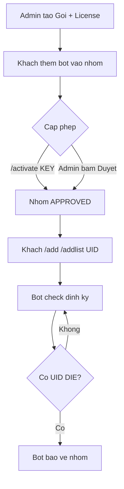

# Hướng dẫn sử dụng - Checklive Bot

> Hướng dẫn vận hành hệ thống bot Telegram check live/die UID Facebook.
> Gồm 2 phần: (A) dành cho Admin dùng web quản trị, (B) dành cho người dùng bot trong nhóm Telegram.

Cập nhật lần cuối: 2026-07-15

---

## 0. Các thành phần & địa chỉ

| Thành phần | Địa chỉ (local) | Vai trò |
|---|---|---|
| Web Admin (frontend) | http://localhost:3000 | Trang quản trị |
| API Backend | http://localhost:3300/api/v1 | Xử lý logic, DB, bot |
| API Docs (Swagger) | http://localhost:3300/api/v1/docs | Thử API |
| Telegram Bot | trong nhóm Telegram | Nhận lệnh, check UID |

Tài khoản admin mặc định (đổi trong `.env` / sau khi seed): `admin@checklive.local` / `admin12345`.

---

## A. HƯỚNG DẪN CHO ADMIN (Web quản trị)

### A1. Đăng nhập
1. Mở http://localhost:3000 -> tự chuyển tới trang đăng nhập.
2. Nhập email + mật khẩu admin -> vào **Tổng quan (Dashboard)**.
3. Menu trái gồm: Tổng quan, Nhóm bot, License, Gói dịch vụ, Người dùng.

### A2. Bước 1 - Tạo Gói dịch vụ (Plans)
Gói định nghĩa **quota** áp cho nhóm dùng bot.
1. Vào **Gói dịch vụ** -> **Tạo gói**.
2. Điền:
   - **Tên gói** (vd: Basic).
   - **Toi da UID**: số UID tối đa mỗi nhóm được theo dõi.
   - **Chu ky check (giay)**: khoảng cách tối thiểu giữa 2 lần check (vd 60).
   - **Toi da nhom**: số nhóm tối đa (dùng cho license nhiều nhóm).
   - **Thoi han (ngay)**: số ngày hiệu lực khi kích hoạt.
   - **Gia (VND)**: để tham khảo.
3. Lưu. (Seed sẵn 3 gói: Trial / Basic / Pro.)

### A3. Bước 2 - Cấp quyền cho nhóm
Có **2 cách** (dùng cách nào cũng được):

**Cách 1 - Duyệt nhóm trực tiếp trên web:**
1. Người dùng thêm bot vào nhóm Telegram trước (xem phần B1). Nhóm sẽ xuất hiện ở **Nhóm bot** với trạng thái **PENDING**.
2. Vào **Nhóm bot** -> bấm **Duyệt** ở nhóm đó -> chọn **gói dịch vụ** -> **Xác nhận duyệt**.
3. Nhóm chuyển sang **APPROVED** + có hạn dùng. Bot bắt đầu hoạt động.
4. Muốn ngừng: bấm **Khóa** (BLOCKED) -> bot ngừng check nhóm đó.

**Cách 2 - Phát License key cho khách tự kích hoạt:**
1. Vào **License** -> **Tạo license** -> chọn **gói** + **số lượng** -> **Tạo**.
2. Copy key (dạng `CL-XXXX-XXXX-XXXX-XXXX`) gửi khách.
3. Khách gõ `/activate KEY` trong nhóm (xem B2) -> nhóm tự thành APPROVED theo gói.
4. Thu hồi: bấm **Thu hồi** (REVOKED) -> key hết hiệu lực (nhóm đã kích hoạt vẫn chạy tới khi hết hạn/khóa).

### A4. Quản lý Nhóm bot
Cột hiển thị: tên nhóm, Chat ID, trạng thái (PENDING/APPROVED/BLOCKED), gói, số UID, hạn dùng.
- **Duyệt**: cấp phép + gán gói.
- **Khóa**: chặn nhóm.

### A5. Quản lý Người dùng (tài khoản web)
- **Duyệt**: cho phép tài khoản USER dùng hệ thống (`canUseApp`).
- **Ban / Bỏ ban**: khóa/mở tài khoản.
- (Tạo admin phụ / đổi role: qua API `/users`.)

### A6. Dashboard
Xem nhanh: tổng số nhóm (bao nhiêu chờ duyệt / đã duyệt), số license (còn hiệu lực), số gói, số người dùng.

---

## B. HƯỚNG DẪN CHO NGƯỜI DÙNG BOT (trong nhóm Telegram)

### B1. Thêm bot vào nhóm
1. Thêm bot (theo username bot của bạn) vào nhóm Telegram.
2. Bot tự ghi nhận nhóm ở trạng thái **chờ duyệt** và nhắn hướng dẫn.
3. Nhóm CHƯA hoạt động cho tới khi được Admin duyệt hoặc kích hoạt license.

### B2. Kích hoạt bằng license (nếu có key)
```
/activate CL-XXXX-XXXX-XXXX-XXXX
```
Thành công -> bot báo tên gói + hạn dùng, nhóm bắt đầu hoạt động.

### B3. Các lệnh quản lý UID (chỉ dùng được khi nhóm đã được cấp phép)
| Lệnh | Ý nghĩa |
|---|---|
| `/add UID|Tên` | Thêm 1 UID để theo dõi |
| `/addlist` | Thêm nhiều UID (mỗi dòng `UID|Tên`, xuống dòng sau lệnh) |
| `/delete UID` | Xóa 1 UID khỏi danh sách |
| `/checkall` | Kiểm tra toàn bộ UID ngay và trả danh sách trạng thái |
| `/start` hoặc `/help` | Xem danh sách lệnh |

Ví dụ `/addlist`:
```
/addlist
100000123|Nguyen Van A
100000456|Tran Thi B
100000789|Le Van C
```

### B4. Cơ chế thông báo
- Bot tự động check theo chu kỳ của gói (vd 1 phút/lần).
- **Chỉ báo khi có UID chuyển sang DIE**; UID còn sống thì không nhắn (tránh spam).
- Nội dung báo: `UID - Tên` / `Trạng thái: Die` / `ngày giờ`.
- Vượt quota UID của gói -> bot báo đã đạt giới hạn, không thêm được nữa.

---

## C. QUY TRÌNH VẬN HÀNH ĐIỂN HÌNH (end-to-end)

1. Admin tạo Gói (A2) -> phát License cho khách (A3 cách 2) HOẶC chờ duyệt nhóm (A3 cách 1).
2. Khách thêm bot vào nhóm (B1).
3. Khách `/activate KEY` (B2) hoặc Admin bấm Duyệt (A3).
4. Khách `/add` / `/addlist` các UID (B3).
5. Bot tự check + báo DIE (B4). Khách gõ `/checkall` khi muốn xem tức thời.
6. Admin theo dõi trên Dashboard, khóa nhóm/thu hồi key khi cần.



---

## D. CẤU HÌNH TELEGRAM WEBHOOK (dành cho người vận hành kỹ thuật)

Sau khi backend chạy công khai (có domain HTTPS), đăng ký webhook:
```
https://<domain>/api/v1/telegram/webhook/<TELEGRAM_WEBHOOK_SECRET>
```
- `TELEGRAM_BOT_TOKEN` và `TELEGRAM_WEBHOOK_SECRET` cấu hình trong `.env` backend.
- Local test có thể dùng ngrok để tạo HTTPS tạm.

---

## E. XỬ LÝ SỰ CỐ THƯỜNG GẶP

| Hiện tượng | Nguyên nhân | Cách xử lý |
|---|---|---|
| Bot không phản hồi lệnh | Nhóm chưa APPROVED / hết hạn | Admin duyệt lại hoặc gia hạn/kích hoạt key mới |
| "Nhom chua duoc cap phep" | Chưa duyệt/license | Duyệt nhóm hoặc `/activate KEY` |
| Không thêm được UID | Đã đạt `maxUids` của gói | Nâng gói hoặc xóa bớt UID |
| Đăng nhập web lỗi 401 | Sai tài khoản / cookie | Kiểm tra email/mật khẩu, thử lại |
| Backend lỗi `P1010` | Sai `DATABASE_URL` / chưa tạo DB | Sửa `.env`, tạo DB, chạy `prisma migrate` |
| Bot không tự check | `SCHEDULER_ENABLED=false` hoặc nhóm hết hạn | Bật scheduler, kiểm tra hạn nhóm |
| Check FB sai/nhiều UNKNOWN | Bị Facebook chặn IP | Cấu hình `PROXY_LIST` (proxy pool) |

---

## F. Lưu ý quan trọng
- Độ chính xác live/die phụ thuộc Facebook, không đạt 100%.
- Quy mô lớn (nhiều UID) BẮT BUỘC dùng proxy pool, nếu không sẽ bị FB chặn.
- Facebook hay thay đổi -> cần bảo trì engine check định kỳ.
- Xem thêm bối cảnh kỹ thuật: `docs/PROJECT.md`.
